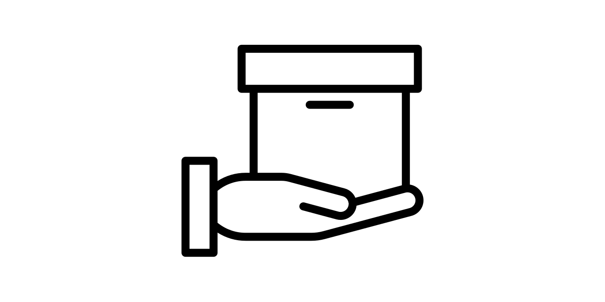

# Products API

[MercadoLibre Clone](https://untalsanders.github.io/products-api-site/) is a RESTful API to the products taxonomy. You will access hundreds of products which have basic information such as images, price, category, description and taxonomic information of the product.

## Getting Started

**Check out the [documentation](https://untalsanders.github.io/products-api-site/documentation) to get started**

## Postman collection

Click the Run in Postman button to fork the collection to your own workspace. You can pull changes if the collection is updated in the future.

## Website

You can check the code of the website [here](https://github.com/untalsanders/products-api-site)

## Support

Help to maintain The Products API's infrastructure [here](https://untalsanders.github.io/products-api-site/help-us).

If you want to know more about The Products API click [here](https://untalsanders.github.io/products-api-site/about).
